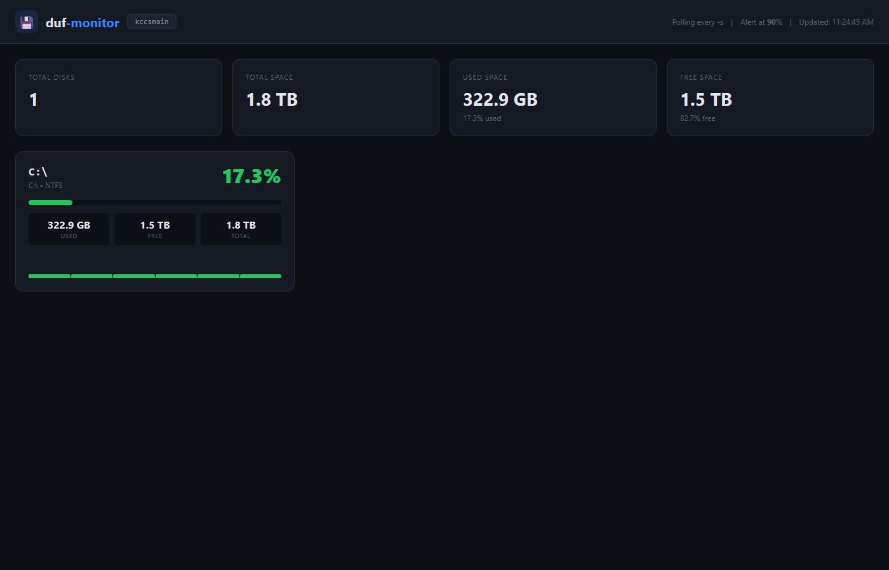

# duf-monitor — Enhanced by KCCS

> A web monitoring dashboard for [duf](https://github.com/muesli/duf) that adds what the CLI has always been missing: historical tracking, threshold alerts, and a real-time web UI.



## What's New in This Fork

- **Web Dashboard** -- Real-time disk usage monitoring from your browser
- **Historical tracking** -- SQLite stores snapshots at configurable intervals with 24h sparklines
- **Threshold alerts** -- Configurable alerts when disks exceed capacity percentages
- **WebSocket live updates** -- Dashboard refreshes in real-time without polling
- **Zero config** -- Works out of the box with `psutil`, no duf binary needed
- **Lightweight** -- Single Python file, minimal dependencies

## Quick Start

```bash
git clone https://github.com/pueblokc/duf.git
cd duf
pip install fastapi "uvicorn[standard]" psutil websockets

python -m uvicorn duf_monitor.app:app --host 0.0.0.0 --port 8503
# Open http://localhost:8503
```

## Screenshots

| Dashboard with Sparklines |
|:---:|
|  |

*Each disk shows current usage, total/used/free space, and a 24-hour usage history sparkline.*

## Features

### Real Disk Data
Uses `psutil` for accurate cross-platform disk readings. Also supports parsing `duf --json` output if the duf binary is available.

### Historical Tracking
SQLite stores disk snapshots at configurable intervals (default: every 5 minutes). View usage trends over time with per-disk sparkline charts.

### Threshold Alerts
Set a disk usage percentage threshold (default: 90%). When any disk exceeds it, alerts are generated and optionally sent to a webhook URL.

### WebSocket Live Updates
The dashboard updates in real-time via WebSocket. No page refreshes, no polling delays.

### Multi-Host Ready
Architecture supports monitoring multiple hosts. Add remote disk data sources as your infrastructure grows.

### Zero Configuration
Works immediately with sensible defaults. Install three pip packages and run. No config files, no duf binary required.

## API Reference

| Method | Endpoint | Description |
|--------|----------|-------------|
| `GET` | `/` | Web Dashboard |
| `GET` | `/api/current` | Current disk usage for all mounts |
| `GET` | `/api/history/{mountpoint}?hours=24` | Usage history for a specific mount |
| `GET` | `/api/alerts` | Recent threshold alerts |
| `POST` | `/api/alerts/{id}/acknowledge` | Acknowledge an alert |
| `WS` | `/ws` | Real-time disk usage updates |

## Environment Variables

| Variable | Default | Description |
|----------|---------|-------------|
| `DUF_PORT` | `8503` | Server port |
| `DUF_DB_PATH` | `./duf_monitor.db` | SQLite database path |
| `DUF_POLL_INTERVAL` | `300` | Seconds between snapshots (default: 5 min) |
| `DUF_ALERT_THRESHOLD` | `90` | Disk usage % to trigger alerts |
| `DUF_WEBHOOK_URL` | _(empty)_ | Webhook URL for alert notifications |

## Architecture

```
duf_monitor/
├── app.py          # FastAPI backend with WebSocket + alerting
├── __init__.py
└── static/
    └── index.html  # Single-file dashboard with sparkline charts
```

## Requirements

- Python 3.9+
- `fastapi`, `uvicorn`, `psutil`, `websockets`
- Works on Linux, macOS, and Windows

## Docker

```bash
# Build
docker build -t duf-monitor .

# Run
docker run -p 8503:8503 duf-monitor
```

---

## Original Project

<details>
<summary>Click to expand original duf README</summary>

# duf

[](https://github.com/muesli/duf/releases)
[](/LICENSE)

Disk Usage/Free Utility (Linux, BSD, macOS & Windows)

## Features

- User-friendly, colorful output
- Adjusts to your terminal's theme & width
- Sort the results according to your needs
- Groups & filters devices
- Can conveniently output JSON

## Installation

### Packages

#### Linux
- Arch Linux: `pacman -S duf`
- Ubuntu / Debian: `apt install duf`
- Fedora: `dnf install duf`
- Nix: `nix-env -iA nixpkgs.duf`

#### macOS
- Homebrew: `brew install duf`

#### Windows
- Chocolatey: `choco install duf`
- scoop: `scoop install duf`

### From source

```bash
git clone https://github.com/muesli/duf.git
cd duf
go build
```

## Usage

```bash
duf              # Show all disks
duf /home        # Show specific mount
duf --all        # Include pseudo filesystems
duf --json       # Output as JSON
duf --sort size  # Sort by size
```

### Filtering

```bash
duf --only local,network
duf --hide-fs tmpfs,vfat
duf --only-mp /,/home
```

### Thresholds

```bash
duf --avail-threshold="10G,1G"
duf --usage-threshold="0.5,0.9"
```

## License

MIT

</details>

---

Developed by **[KCCS](https://kccsonline.com)** | Monitor by [@pueblokc](https://github.com/pueblokc) | [kccsonline.com](https://kccsonline.com)
